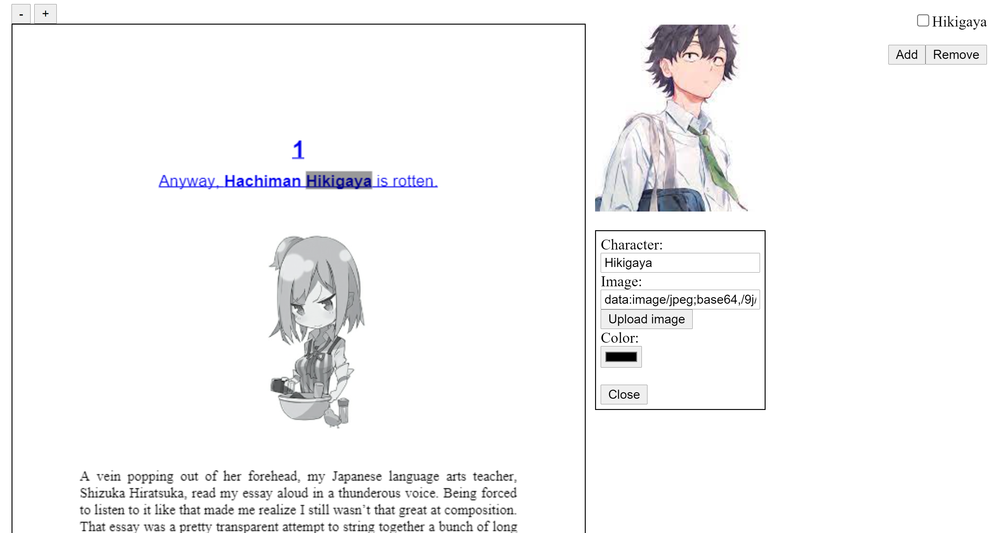

# (Light) Novel Reader Tool

Inspired by [xVal's Chai Mager](https://xval.me/chaimager.html), a web app that lets you highlight certain words in the novel and lets you put an image to associate with that word. Unfinished and probably will go unfinished since I want to improve this quite a lot. Wanted to put on GitHub to kind of force me to work on it and so that there is someplace where this is stored if my computer crashes.

# TODO
- [ ] Choose different JavaScript backend like React or Angular
- [ ] Remake the entire thing (basically)
- [ ] Make it so scaling the browser scales the page
- [ ] Figure out how to save states and stuff
